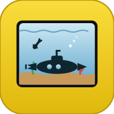
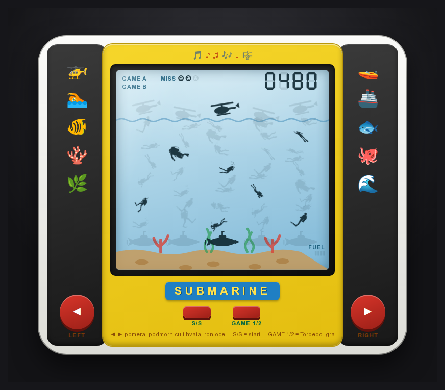
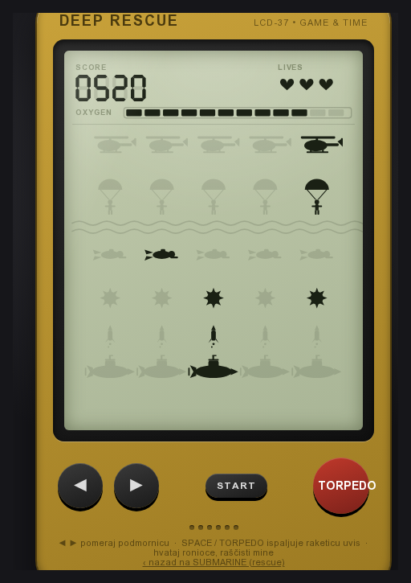
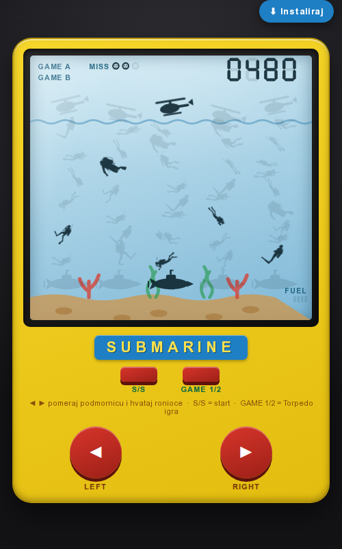

# Retro LCD Handheld igre

Dve samostalne HTML igre koje imitiraju **prave stare LCD „Game & Watch" / „Game Watch" konzole**
(pre-drawn LCD segmenti, bez canvas-a, bez biblioteka). Svaki fajl se otvara duplim klikom u browseru.

**▶ Uživo (GitHub Pages):** https://acosonic.github.io/retrogames/  
Može da se **instalira kao aplikacija** (PWA) i radi offline.

<p align="center"></p>

| Fajl | Igra | Izgled ekrana |
|------|------|---------------|
| `index.html` | **Submarine (rescue)** — glavna; spasavanje ronilaca podmornicom | plavi podvodni LCD (more, koral, alge) |
| `torpedo.html` | **Deep Rescue** — podmornica gađa mine torpedom i hvata ronioce | zelenkasto-sivi G&W LCD |
| `svg/` | 18 realnih scuba-diver silueta (ugrađene u `index.html`) | — |

### Screenshots

| Submarine (rescue) — glavna | Torpedo |
|:---:|:---:|
|  |  |

**Mobilni (uspravni) prikaz** — responsive: žuto telo igrice (kao torpedo), ekran preko cele širine, **bez bočnih ukrasa i crnih hvataljki**; LEFT/RIGHT i S/S/GAME 1/2 su dugmad **na okviru** ispod ekrana. Gore-desno je **PWA „⬇ Instaliraj"** dugme (vidljivo kad browser dozvoli instalaciju):

<p align="center"></p>

---

## Glavni princip: „pre-drawn LCD layout"

Ovo **nije** klasična video igra koja pomera objekte pixel-po-pixel. Radi kao pravi LCD panel:

- **Svi mogući objekti su unapred nacrtani** na svojim fiksnim pozicijama.
- **Neaktivni** segment je jedva vidljiv (`opacity ~0.11`), **aktivni** je taman (`opacity ~0.9`).
- JavaScript **ne pomera ništa** — samo pali/gasi `.on` klasu na unapred nacrtanim pozicijama.
- Kretanje (npr. ronilac koji tone) = paljenje sledeće niže pozicije u koloni, gašenje prethodne.

```css
.lcd-seg      { fill: var(--lcd-ink); opacity: .11; filter: blur(.25px); }
.lcd-seg.on   { opacity: .9; }
```

```js
function on(id, state){ document.getElementById(id)?.classList.toggle("on", !!state); }
```

Boja segmenta se **nasleđuje** sa grupe (`fill` je nasledna osobina u SVG-u), pa kad ubacimo tuđi SVG
ne moramo da diramo njegov `fill` — automatski postaje crna LCD „tinta".

---

## Arhitektura (zajednička za obe igre)

Sve je u jednom `<svg>` elementu, građeno iz JS-a pri učitavanju:

1. **Pomoćnici** — `S(tag,attrs)` pravi SVG element, `on(id,bool)` pali/gasi segment,
   `silo(id,cx,cy)` pravi grupu-segment, `add(g,tag,attrs)` dodaje deo siluete.
2. **Siluete** — funkcije koje crtaju objekte centriran oko (0,0): `heli`, `diver`, `sub`, `mine`, `torp`…
3. **7-segmentne cifre** — `drawDigit/setDigit` (skor / sat), klasične a–g sekcije kao poligoni.
4. **Statični layout** — sve siluete i status (labeli, životi, gauge) nacrtani jednom, bledo.
5. **Zvuk** — WebAudio „beep" preko `square` talasa (bez audio fajlova).
6. **Logika** — `state` objekat + `step()` petlja + `render()` koji samo toggluje `.on`.

### Petlja i brzina

Petlja je `setTimeout` (ne fiksni `setInterval`) pa se **kašnjenje preračunava posle svakog poteza**
— igra počinje lagano i postepeno se ubrzava sa skorom:

```js
function currentDelay(){ return Math.max(500, 1300 - Math.floor(state.score/100)*40); }
// 0 bodova -> 1300ms ... 2000+ -> 500ms (pod)
```

### Zvuk (WebAudio)

`AudioContext` se inicijalizuje tek na **prvi korisnički klik** (START) — browseri ne dozvoljavaju
audio bez interakcije. `tone(freq,dur,type,vol,delay)` svira jedan ton; iz njega su složeni efekti:
`sndStart`, `sndCatch`, `sndHit`, `sndOver`, (u torpedu i `sndFire`, `sndMine`).

---

## `torpedo.html` — Deep Rescue

Zelenkasto-sivi G&W ekran (`viewBox 0 0 520 660`), zlatno-žuto kućište.

**Layout (5 kolona × redovi):** helikopteri → padobranci → talasi → ronioci → mine → torpeda → podmornice,
plus status: SCORE (4 cifre), LIVES (srca), OXYGEN (12-segmentni bar).

**Logika:**
- Helikopter leti levo-desno i izbacuje ronioce; oni tonu kroz redove (`row 1→2→3`).
- Pomeraš podmornicu `◄ ►`; poravnata sa ronicem na dnu = **+10 i kiseonik**, promašaj = život.
- **Mine** su vidljive i stabilne (traju 8 poteza — nema iznenadnog paljenja); blokiraju spasavanje.
- **TORPEDO / SPACE** ispaljuje raketicu uvis; uništava minu u koloni podmornice (+5).
- Kiseonik opada s vremenom; 3 života; kraj → trepćući „GAME OVER".

---

## `index.html` — Submarine (samo rescue)

Plavi podvodni LCD (`viewBox 0 0 460 432`), kućište po uzoru na „SUBMARINE" handheld
(žuto telo, crne hvataljke, bela krila, plavi natpis, crveni LEFT/RIGHT + S/S + GAME 1/2 dugmad).

**Kolor „štampana" pozadina** (uvek vidljiva, iza segmenata) — kao na pravoj igrački gde boje
dolaze sa zadnjeg štampanog sloja: crveni koral, zelene alge, braon peščano dno, plavi talas na površini.
Pokretni objekti (helikopter, ronioci, podmornice) su crni segmenti preko toga.

### Ronioci — prave SVG siluete

Umesto ručno crtanih štapića, koriste se realne siluete iz `svg/` (poze **07, 10, 13, 14, 15**).

- `DIVER_PATHS` = nizovi `path d` stringova, ugrađeni inline (jer `fetch` ne radi preko `file://`).
- Svaka poza se **auto-centrira i auto-skalira** preko `getBBox()` na `DIVER_TARGET` (≈38px):
  ```js
  // za svaku varijantu: izmeri bbox, izračunaj centar i razmeru
  return { cx, cy, s: DIVER_TARGET / Math.max(b.width, b.height) };
  // transform: translate(x,y) rotate(rot) scale(flip*s, s) translate(-cx,-cy)
  ```
- **Glavom nadole, više horizontalno:** silueta gleda udesno; rotira se 30–48° naniže (`diveAngle`),
  a `flip = ±1` okreće glavu levo/desno → rone dijagonalno ka podmornici.
- Po nivoima/kolonama se bira **različita poza** (`vi = (lv*2+i*3) % 5`) — nisu svi isti.

### Razbacanost (leluja kao voda)

Pošto su pozicije fiksne, „talasanje" se postiže **razbacanim crtanjem**, ne animacijom:
- `swayX(lv,i,n)` — svaka kolona je blaga vijugava S-linija (različita faza) → vertikala nije prava;
- `bobY(lv,i)` — mala razlika po visini → red nije ravan;
- dok ronilac tone kroz nivoe, sam vijuga.

### Promenljiv broj nivoa po koloni

Kao na originalu (levo manje, desno više ronioca):

```js
const COLDEPTH = [6,7,8,8,9];   // kolona 0 ima 6 nivoa, kolona 4 ima 9
// ronilac u plićoj koloni stigne do podmornice brže, u dubljoj sporije
```

### Helikopteri

Na **različitim visinama** (`HELI_BOB`) i **nagnuti pod uglom** (`HELI_TILT`) — nisu u istoj liniji,
i deluju banked dok izbacuju ronioca.

---

## Kako su ugrađene SVG siluete (reproducibilno)

SVG-ovi su `viewBox 0 0 4096 4096`, jedan-dva `<path>` po fajlu. Patch je urađen Python skriptom koja:

1. iz izabranih fajlova izvuče sve `d="…"` i sažme razmake;
2. složi `DIVER_PATHS` kao validan JS niz (`json.dumps`);
3. zameni stare funkcije u `index.html` (diver, heli) novim verzijama i ubaci `DIVER_PATHS`.

Da se promene poze — izmeni listu fajlova u skripti (npr. dodaj `scuba-diver-17.svg` za ronjenje
pravo naglavačke) i ponovo pokreni patch. (Skripta nije commit-ovana; jezgro je opisano gore.)

---

## PWA (instalacija + offline)

Projekat je Progressive Web App — može da se „instalira" na telefon/desktop i radi bez interneta:

- `manifest.json` — ime, ikone, boje, `display: standalone`.
- `service-worker.js` — kešira shell (`index.html`, `torpedo.html`, ikone, manifest); navigacija je
  *network-first* sa fallbackom na keš, ostalo *stale-while-revalidate*.
- Ikone: `favicon.svg` (izvor) → `web-app-manifest-192/512`, `apple-touch-icon`, `favicon-96x96`, `favicon.ico`.
- `.nojekyll` (GitHub Pages ne procesira sadržaj), `.htaccess` (SW i manifest se ne keširaju).
- **Instalacija:** otvori sajt → u browseru „Install app" / „Add to Home Screen".
- **„GAME 1/2"** dugme na rescue ekranu prebacuje na Torpedo igru (i nazad linkom).

> Posle promene shell-a povećaj `CACHE_VERSION` u `service-worker.js` (inače korisnici ostaju na staroj verziji).

---

## Štelovanje (gde se šta menja)

| Šta | Gde |
|-----|-----|
| Brzina / ubrzavanje | `currentDelay()` — početnih `1300` i pod `500` |
| Učestalost izbacivanja ronioca | `state.tick % 2` (rescue) / `% 3` (torpedo) u `step()` |
| Veličina ronioca | `DIVER_TARGET` (rescue) |
| Koliko su ronioci nagnuti naniže | `diveAngle` (`30+18*…`) |
| Raspored dubina po kolonama | `COLDEPTH = [6,7,8,8,9]` |
| Razbacanost / leluja | `swayX`, `bobY` |
| Nagib helikoptera | `HELI_TILT`, visine `HELI_BOB` |
| Mine (torpedo): učestalost/trajanje | `Math.random()<0.6`, `state.mineT[c]=8` |
| Boje (LCD / kućište) | CSS `:root` promenljive na vrhu fajla |
| Bočne sličice (rescue) | `.decals` (veličina/razmak) + emoji u `<div class="decals">` |

---

## Testiranje (tokom razvoja)

Bez ručnog otvaranja browsera u svakom koraku:

- **Sintaksa/izvršavanje JS-a** — Node sa stub DOM-om (`createElementNS`, `getBBox`, `setTimeout`)
  učita `<script>` blok i potvrdi da se izvršava bez greške.
- **Vizuelna provera** — `google-chrome-stable --headless --screenshot` renderuje statičan ekran;
  za prizor igre se privremeno ubaci ručno `state` (aktivni segmenti) pa se snimi.
- **Uvećanje** — `ImageMagick convert -crop … -resize` za detalje (orijentacija ronilaca, nagib helikoptera).

---

## Kredit i licenca asseta

Scuba-diver siluete su **plaćeni (licencirani) asseti** i **nisu uključene u ovaj repo**
(folder `svg/` je u `.gitignore`). U igri se koristi samo geometrija 5 silueta, ugrađena
direktno u `index.html` kao deo gotovog proizvoda. Sirovi `.svg` fajlovi se ne distribuiraju.

Sve ostalo (kod, kućišta, logika, zvuk, ikona) je napravljeno u okviru ovog projekta.
